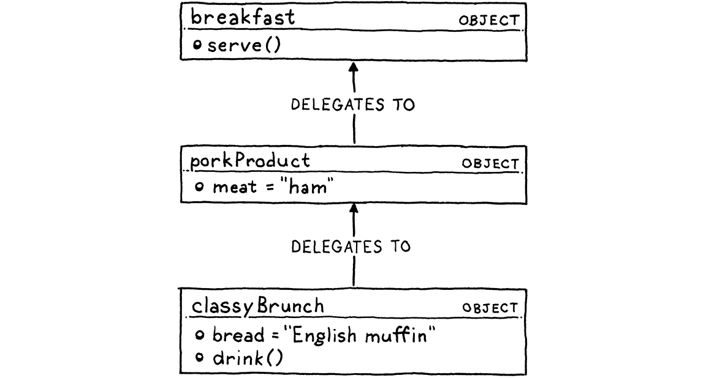

## Chapter 1

#### Challenges:
Are done inside lox/clox directories!

## Chapter 2

#### Challenges:
1. Pick an open source implementation of a language you like. Download the source code and poke around in it. Try to find the code that implements the scanner and parser. Are they hand-written, or generated using tools like Lex and Yacc? ( .l or .y files usually imply the latter.)

Of course I picked Zig. 

What I found is that Zig bootstraps itself in the bootstrap.c file. While running it, the following things happen:

```
1. **Compiling `zig-wasm2c`**:
   `c
   cc, "-o", "zig-wasm2c", "stage1/wasm2c.c", "-O2", "-std=c99"
   `
   - **Purpose**: This command compiles a C file, `wasm2c.c`, into an executable named `zig-wasm2c`.
   - **Functionality**: This executable likely converts WebAssembly (WASM) modules into C code, as suggested by its name and the source file directory (`stage1` suggests an early step in the build process).

2. **Running `zig-wasm2c`**:
   `c
   "./zig-wasm2c", "stage1/zig1.wasm", "zig1.c"
   `
   - **Purpose**: This uses the previously compiled `zig-wasm2c` to process a WASM file (`zig1.wasm`).
   - **Functionality**: The output is `zig1.c`, which implies that the WASM file is being translated to a C source file, possibly part of bootstrapping or setting up a larger compilation process.

3. **Compiling `zig1`**:
   `c
   cc, "-o", "zig1", "zig1.c", "stage1/wasi.c", "-std=c99", "-Os", "-lm"
   `
   - **Purpose**: Compiles the `zig1.c` (generated from `zig-wasm2c`) along with `wasi.c` into an executable named `zig1`.
   - **Functionality**: This executable likely represents a preliminary version of the main software being built, possibly including some WASI (WebAssembly System Interface) support, indicated by the inclusion of `wasi.c`.

4. **Running `zig1` for various build tasks**:
   - Building a C file:
     `c
     "./zig1", "lib", "build-exe", "-ofmt=c", "-lc", "-OReleaseSmall", "--name", "zig2", "-femit-bin=zig2.c", "-target", host_triple
     `
   - Building an object file:
     `c
     "./zig1", "lib", "build-obj", "-ofmt=c", "-OReleaseSmall", "--name", "compiler_rt", "-femit-bin=compiler_rt.c", "-target", host_triple
     `
   - **Purpose**: These commands utilize `zig1` to orchestrate further build steps, generating intermediate C source or object files (`zig2.c`, `compiler_rt.c`).
   - **Functionality**: It demonstrates the capability of `zig1` to manage dependency tracking and target-specific builds, as indicated by the parameters like `-target` and `-ofmt=c`.

5. **Compiling `zig2`**:
   `c
   cc, "-o", "zig2", "zig2.c", "compiler_rt.c", "-std=c99", "-O2", "-fno-stack-protector", "-Istage1"
   `
   - **Purpose**: Compiles `zig2.c` and `compiler_rt.c` into the final executable `zig2`.
   - **Functionality**: This is likely the final or near-final version of the software, incorporating all previous build steps and optimizations. The inclusion of `compiler_rt.c` suggests it links with runtime support, necessary for comprehensive functionality in the environment it's targeted for.
```

A good source on why Zig went with WASM (and left C++) is: https://ziglang.org/news/goodbye-cpp/

Initially the Zig bootstrap was using C++ and did not free memory, until the compilation was over. Now Andrew chose to use a WASM virtual machine, thats written in C. WASM is architecture agnostic, so using it to build needed C files — that could be architecture dependent — is a big strategic win, cause now these files are going to be transpiled from WASM to correct C code, matching the architecture you compile it on.

The entire bootstrapping structure looks like this:

```
+----------------------+           +-------------------+
|  stage1/wasm2c.c     |           |  stage1/zig1.wasm |
|  Compile with $CC    |           |  WASM file        |
+----------------------+           +-------------------+
         |                                    |
         |                                    |
         V                                    V
+----------------------+   +---------------------------------+
|  Executable:         |   |  Generate zig1.c using           |
|  zig-wasm2c          +--->  ./zig-wasm2c                    |
+----------------------+   +---------------------------------+
                                         |
                                         |
                                         V
                              +-------------------------+
                              |  zig1.c                 |
                              |  Compile with $CC       |
                              |  +                      |
                              |  stage1/wasi.c          |
                              |                         |
                              +-------------------------+
                                         |
                                         V
                              +-------------------------+
                              |  Executable:            |
                              |  zig1                   |
                              +-------------------------+
                                         |
             +---------------------------+---------------------------+
             |                           |                           |
             V                           V                           V
+-------------------------+   +-------------------------+   +-------------------------+
|  Build zig2.c using     |   |  Build compiler_rt.c    |   |  Other builds using     |
|  ./zig1 as a tool       |   |  using ./zig1 as a tool |   |  ./zig1 as a tool       |
|  (e.g., compiler passes)|   |  (e.g., runtime support)|   |  (custom commands)      |
+-------------------------+   +-------------------------+   +-------------------------+
             |                           |                           
             |                           |                           
             V                           V                           
+-------------------------+   +-------------------------+            
|  Compile zig2.c and     |   |  Compile compiler_rt.c  |           
|  compiler_rt.c with $CC |   |  with $CC separately    |           
|  to create zig2         |   |  (if needed)            |           
+-------------------------+   +-------------------------+            
```

The essence is in the 2 first rows, where the WASM transpiler is compiled, and used to transpile zig1.wasm to zig1.c.

Then I guess that build.zig is the compiler file. 

1. Just-in-time compilation tends to be the fastest way to implement a dynamically-
typed language, but not all of them use it. What reasons are there to not JIT?

Just in time is the second option after Ahead of time (for compiled languages, remember other use interpreters, and some like Python can be both interpreted and JITed).

Haven't really found a single best answer, that I would really like. In general JIT needs a longer startup time, consumes more memory and is more CPU hungry.

3. Most Lisp implementations that compile to C also contain an interpreter that lets them execute Lisp code on the fly as well. Why?

Probably because it allows the best of both worlds? You can get a fast compiled version of the program, or use an interpreter to iterate over ideas fast, with dynamic typing.

## Chapter 3 "The Lox Language"

We go through an overview of how the Lox (Java implementation) will look like. 

- Dynamic Typing

Our language will not be checking types staticaly, ie. you will only know if you have a type problem if you encounter it during runtime. Can interpreted language even have static type checking? Yes, for example if you type everything in Python, you can then use something like mypy to staticaly check the types, before you go into interpreter. In typescript — i think — it happens during the transpilation from typescript to javascript, only then you interpret the produced javascript code. Dynamic typing means we don't specify types, it happens automatically.  

- Automatic Memory Management

Both our languages will be using Garbage Collection. Reference counting would be easier, and is what usually languages like Python start with. Though later they move to garbe collecting. Reference counting uses a counter for each allocated memory, everytime the reference to an object is created the counter goes up, and goes down when reference is removed. When it reaches 0, the memory is automatically freed. Garbage collection is more hustle, but we will implement it, cause it's better and more fun. 

- Types

We will have simple and dynamic types. We've already talked about dynamic typing. Types are the smallest, atomic part of the language (atoms are not the smallest particles, but you get the gist). The types we will use: Boolean, Number (double precision float for all numbers), String, Nil (Java's null). 

- Expressions

If types are atomes, expressions are molecules. We will support: arithmetic (+, -, /, *), comparison and equality (<, <=, >, >=, ==), and logical expressions (!, and, or). Operators are mostly infix (between atoms) or could be also prefix (in front of an atom), some are both (negative/sub operator). A careful reader will see that we skipped some popular operators, ie. modulo.

- Statements

Expressions produce values, statements don't, they change some state, read input or produce output. One of the statements in Lox will be `print`. Yeah, print is not a function here, which means we can print stuff before we have working function calling. 

- Variables

Turns out `var` used to define variables is also a statement. We can either define a variable with some value, or empty that starts with `nil` assigned. 

- Control Flow

Control flow is all the tools used to a). skip some code, b). repeat some code. We will use: if, while, andfor loops. 

- Functions

Function calls are typical here — `function()`. When we do it without parenthesis, it will only reference the function, without calling it. 

```
fun printSum(a, b) {
    print a+b;
}
```

The important distinction is between arguments, and parameters. They are not the same. Arguments is the values we pass to a function, parameters are the variables inside the function, that hold these values. If a function doesn't explicitly return something, it returns `nil` — one of the useful cases of having a nil.

- Closure

The functions in Lox are going to be first class citizens: they can be passed around, stored in variables, can be referenced etc. So this works:
 
 
``` 
fun identity(a) {
    return a;
  }
  print identity(addPair)(1, 2); // Prints "3".
```

Since function definitions are also statements, you can place one function in the other.

```
 fun outerFunction() {
    fun localFunction() {
      print "I'm local!";
    }
    localFunction();
  }
```

Turns out this also works:

```
  fun returnFunction() {
    var outside = "outside";
    fun inner() {
      print outside;
    }
    return inner;
  }
  var fn = returnFunction();
  fn();
```

This is an often used concept. `inner` is a closure, it means it has access to variables in the scope that encompasses it. With the typical understanding of scope, we would expect the function to only have access to variables that are defined in it, with closurese, function have access to variables in one scope higher. 

- Classes 

Why does Lox have classes? We have first class citizen functions, closures, block scopes, we are almost functional. Yet, we implement classes? We are smart about it. We aren't going into all inheritance haze. 

```
Class-based Programming
Languages: Java, C#, Python.
Structure: Objects are instances of classes. Classes define the structure and behavior for objects.
Features:
- Inheritance: Hierarchical, class-based.
- Encapsulation: Groups data and methods into classes.
- Abstraction: Uses abstract classes and interfaces.
- Polymorphism: Objects of different classes can be treated as instances of a common superclass.

Prototype-based Programming
Languages: JavaScript.
Structure: Objects are cloned from other objects (prototypes). Each object can serve as a prototype.
Features:
- Inheritance: Direct from other objects via prototypes.
- No Classes: Uses flexible, cloneable prototypes instead of rigid classes.
- Dynamic Modification: Objects can be altered after creation.
- Flexibility: High, with dynamic, on-the-fly alterations to object structures.

Key Differences
- Class Structure: Class-based uses rigid class definitions; prototype-based uses mutable prototypes.
- Inheritance: Class-based has fixed hierarchical inheritance; prototype-based uses a more flexible, object-based inheritance chain.
- Object Creation: Class-based constructs new instances through class constructors; prototype-based creates new objects by cloning and extending existing ones.
```

In class based, the instances got to look stuff up in classes and classes these classes inherit from. 


In prototype based, the objects inherit from (delegate to) objects! Turns out people still use them as classes in prototype based languages like JavaScript. 



Function definition in Lox is as follows:

```
class Breakfast {
  init(meat, bread) {
    this.meat = meat;
    this.bread = bread
  }
  cook() {
    print "Eggs a-fryin'!";
  }

  serve(who) {
    print "Enjoy your breakfast, " + who + ".";
  }
}

var myBreakfast = Breakfast("bacon", "toast");
myBreakfast.drink = "water";
myBreakfast.serve("Reader");
```

We skip the `fun` keyword. Classes are also first class citizens, meaning they can be passed as values to variables and functions. Classes are instantiated using a self function call, in Lox the class itself is a factory function for instances. 

- Inheritance 

Lox supports inheritance with `<` operator.

```
class Brunch < Breakfast {
  init(meat, bread, drink) {
    super.init(meat, bread);
    this.drink = drink;
  }
}
```

Both the subclass (derived), and it's base (super) class want to init their init functions, access atributes etc, to distinguish we use `this` and `super`.

Lox is not pure object oriented PL, in the sense that the primitive values like numbers and Booleans are not instances of classes. 

- Standard Library

Standard Library is the set of functionality that is implemented directly in the interpreter, and that all user-defined behavior is built on top of. Well this house is not abundant. We are only going to have `print` and `clock()`, yeah that's it. Although it would be fun to add some I/O or user input. 

#### Challenges:

1. Write some sample Lox programs and run them (you can use the implementations of Lox in my repository). Try to come up with edge case behavior I didn’t specify here. Does it do what you expect? Why or why not?

Didn't really find any edge case, but I wasn't really looking — what would I look for? Like I've got no idea. Downloaded the interpreters, compiled them, and run a silly helloworld.

2. This informal introduction leaves a lot unspecified. List several open questions you have about the language’s syntax and semantics. What do you think the answers should be?

TODO

3. Lox is a pretty tiny language. What features do you think it is missing that would make it annoying to use for real programs? (Aside from the standard library, of course.)

Multithreading I guess? 
